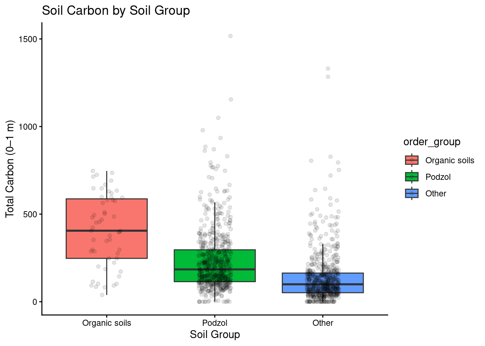
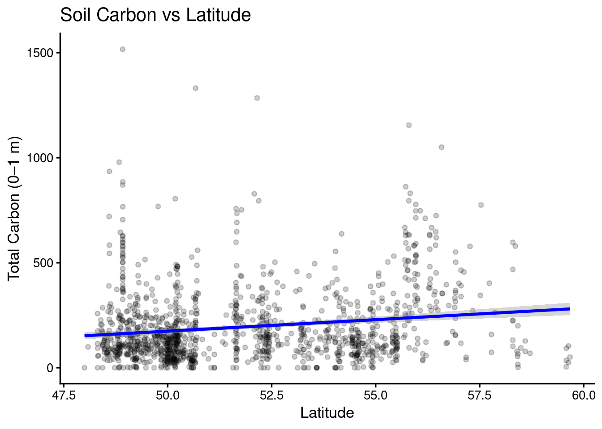
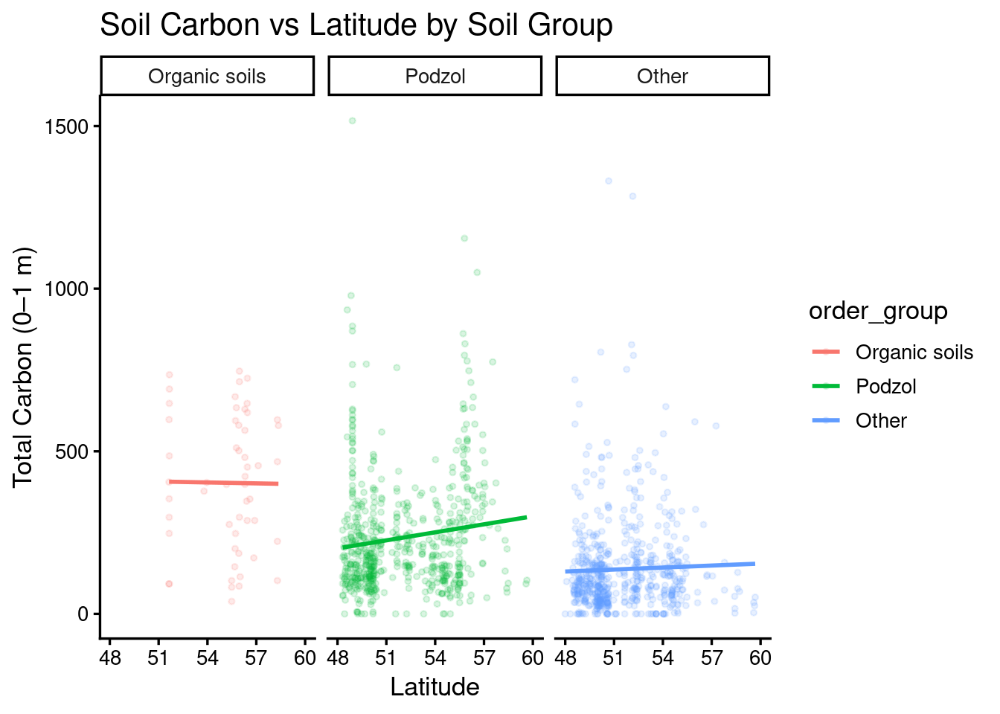

## Project title  
Soil Carbon Variation Across Soil Types and Latitude in a Coastal Temperate Rainforest  

by Wen Du  

---

## Introduction

This project examines how soil organic carbon varies across soil types and geographic gradients using a coastal temperate rainforest dataset from McNicol et al. (2019). The analysis focuses on three main questions: whether soil carbon differs across soil orders, whether there is a relationship between latitude and soil carbon, and whether this relationship varies among soil types. In addition, based on instructor feedback, the contribution of organic and mineral horizons within mineral soils is also evaluated.

## Methods
To ensure independence of observations, the dataset was filtered to include only pedon-level measurements (`pedon_start == TRUE`),  resulting in 1,283 unique soil profiles. Soil classification was based on soil order rather than the presence of organic horizons, which avoids misclassifying mineral soils that commonly contain organic surface layers. Soil orders were grouped into three categories: Organic soils, Podzol, and Other,  in order to reduce complexity and improve interpretability. 

Exploratory analysis was performed using boxplots to visualize differences in carbon storage among soil groups. Because the data were strongly skewed with several extreme values, median values were used to describe typical carbon storage, while means were also reported for comparison. A one-way ANOVA was conducted to test whether differences among soil groups were statistically significant.

Linear regression was used to examine the relationship between soil carbon and latitude. A multiple regression model was then fitted by adding soil group as an additional predictor. Finally, the contribution of mineral and organic horizons within mineral soils was quantified by summing carbon content across horizons.

## Results & Discussion
Clear differences in soil carbon were observed among the three soil groups. Organic soils had the highest median carbon (~405), followed by Podzol (~184), while Other soils had the lowest median (~99). Mean values showed a similar pattern, although they were slightly higher due to the influence of extreme values. The ANOVA results indicated that these differences were highly significant (F = 100.6, p < 2e-16), suggesting that soil type is a strong predictor of carbon storage.

A weak but statistically significant positive relationship was found between latitude and soil carbon. This simple linear regression model shows that carbon tends to increase slightly with latitude (estimate ≈ 10.95, p ≈ 2.26e-09). However, the explanatory power of this model was low (R² ≈ 0.028), indicating latitude alone only explains a small portion of the variation in soil carbon. This pattern may reflect slower decomposition rates at higher latitudes within this temperate rainforest region.

When soil group was added to the model, the explanatory power of increased substantially (R² ≈ 0.138), while the effect of latitude remained statistically significant but weaker (estimate ≈ 5.56, p ≈ 0.0019). this suggests that soil type plays a more important role than latitude in controlling carbon storage.

Within mineral soils, carbon storage was found to be unevenly distributed between horizon types. Approximately 63% of carbon is stored in mineral horizons while 37% in organic horizons. This indicates that mineral horizons still contribute substantially to carbon storage, even in soils classified as mineral.

## Conclusion
Overall, soil carbon was found to vary strongly among soil groups. Organic soils order generally have higher median and mean carbon content values. While in soils classified as mineral, the mineral horizons still contribute substantially to carbon storage. Soil type is the primary driver of soil carbon variation, while latitude plays a secondary and relatively weak role. These findings provide a clearer understanding of soil carbon patterns in this region.

---

## Presentation

The presentation slides can be found in presentation/presentation.html.

---

## Data

McNicol, G. et al. (2019). Coastal temperate rainforest soil carbon [used the 2024 version]  
Retrieved April 2026. Link: https://datadryad.org/dataset/doi:10.5061/dryad.5jf6j1r 

---

## Reference
McNicol, G., Bulmer, C., D’Amore, D., Sanborn, P., Saunders, S., Giesbrecht, I., Gonzalez Arriola, S., Bidlack, A., Butman, D., & Buma, B. (2019). Large, climate-sensitive soil carbon stocks mapped with pedology-informed machine learning in the North Pacific coastal temperate rainforest. Environmental Research Letters, 14, 014004. https://doi.org/10.1088/1748-9326/aaed52 