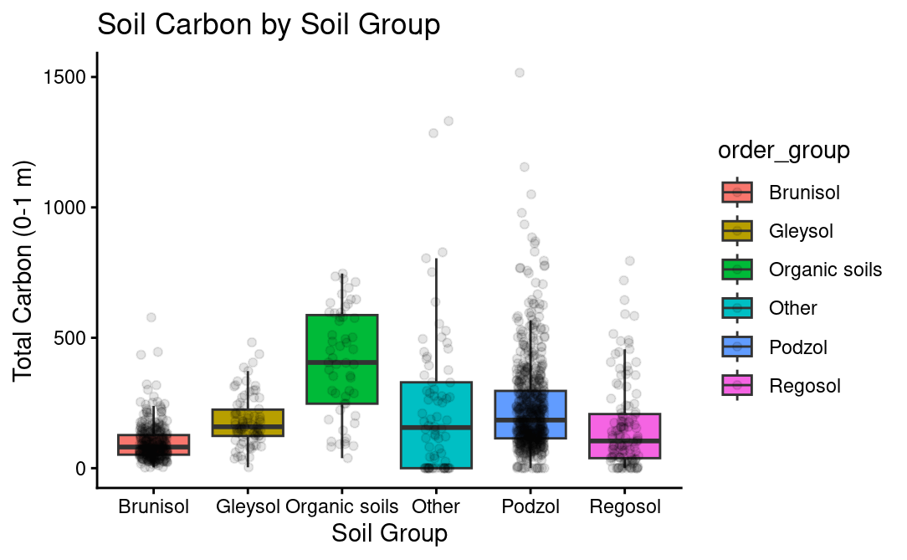
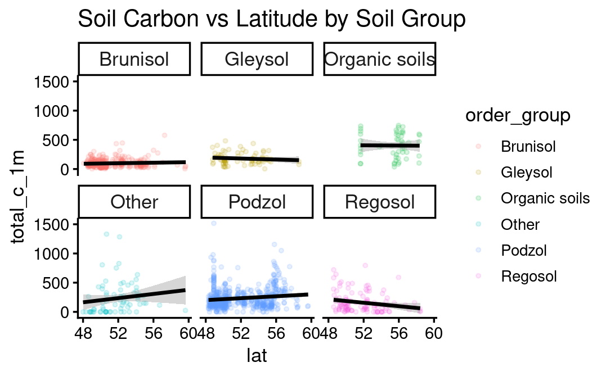

```{r load-packages, include = FALSE}
# Add any additional packages you need to this chunk
library(tidyverse)
library(knitr)
library(xaringanthemer)
library(broom)
```

```{r setup, include=FALSE}
# For better figure resolution
knitr::opts_chunk$set(fig.retina = 3, dpi = 300, fig.width = 6, fig.asp = 0.618, out.width = "80%")
```

```{r load-data, include=FALSE}
# 1. Load your data here
df <- read_csv("../data/data_final_project.csv")

# 2. Create Pedon-level Dataset
pedon_df <- df %>%
  filter(pedon_start == TRUE) %>%
  mutate(
    order_group = case_when(
      str_detect(order, regex("Histosol|Folisol|Mesisol|Humisol|Cryo", ignore_case = TRUE)) ~ "Organic soils",
      str_detect(order, regex("Podzol", ignore_case = TRUE)) ~ "Podzol",
      str_detect(order, regex("Brunisol|Brunisolic", ignore_case = TRUE)) ~ "Brunisol",
      str_detect(order, regex("Gleysol|Gleysolic", ignore_case = TRUE)) ~ "Gleysol",
      str_detect(order, regex("Regosol|Regosolic", ignore_case = TRUE)) ~ "Regosol",
      TRUE ~ "Other"
    )
  ) %>%
  select(pedon_id, order, order_group, total_c_1m, lat) %>%
  filter(!is.na(total_c_1m), !is.na(order_group))
# check structure
glimpse(pedon_df)

# check sample sizes
pedon_df %>% count(order)
```

```{r}
style_xaringan(
  title_slide_background_image = "img/tree-soil.png"
)
```


class: center, middle

## A statement of the overall goal / research question

---

class: inverse, center, middle

# Soil Carbon Variation Across Soil Types and Latitude

### data from the North Pacific coastal temperate rainforest
---

# Research Questions

- Do soil carbon values differ across soil types?

- Is there a relationship between latitude and soil carbon?

- Does this relationship vary among soil types?

- How important are organic horizons in mineral soils?
---

# Data & Approach

- Dataset: North Pacific Coastal temperate rainforest (McNicol et al., 2019)

- Analysis at **pedon level**

- Soil classified by **soil order** (not horizons)

- Methods:

  - Compare soil carbon across soil types (ANOVA)

  - Examine relationship with latitude (regression)

  - Test whether this relationship differs across soil types

---
# Soil Type Differences


```{r echo = FALSE, out.width = "60%", fig.align = "center"}

```
- Strong differences across soil groups
- Organic soils show highest carbon
- ANOVA: p < 2e-16
---

# Latitude vs Soil Carbon
```{r castle, echo = FALSE, out.width = "60%", fig.align = "center"}

```

- Positive relationship detected
- p ≈ 2e-09
- But very weak:
- R² ≈ 0.03


---

# Model Improvement

- Adding soil group improves model:
- R² increases to ~0.18
- Soil type explains much more variation than latitude
- Latitude alone is not a strong predictor
---

# Interaction Effect
- Relationship differs across soil types
- Significant interaction for Regosol
- Most groups show weak or no interaction

---

## Horizon Contribution

- Focus on mineral soils
- Carbon distribution:
- ~63% mineral horizons
- ~37% organic horizons
- Organic horizons still important

---

# Key Takeaways

- Soil type is the main driver of carbon variation
- Latitude shows a weak but significant trend
- Relationships vary across soil types
- Organic horizons contribute substantially, even in mineral soils
---

