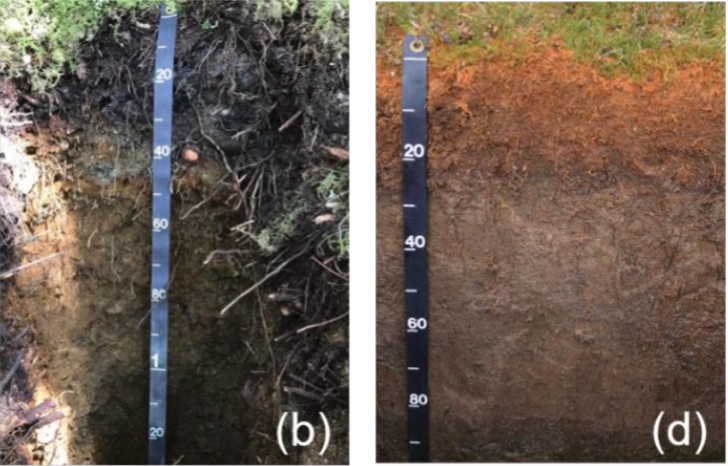

```{r load-packages, include = FALSE}
# Add any additional packages you need to this chunk
library(tidyverse)
library(knitr)
library(xaringanthemer)
library(broom)


```

```{r setup, include=FALSE}
# For better figure resolution
knitr::opts_chunk$set(fig.retina = 3, dpi = 300, fig.width = 6, fig.asp = 0.618, out.width = "80%")
```

```{r load-data, include=FALSE}


# check sample sizes

```

```{r, include = FALSE}
style_xaringan(
  title_slide_background_image = "img/tree-soil.png"
)
```

class:middle

# Introduction 


- **Dataset**: North Pacific Coastal temperate rainforest (McNicol et al., 2019)

 - Two main types of soil in study area: 
   - mineral (Spodosol, figure (b)), and Organic (Histosol, figure(d)).
```{r echo = FALSE, out.width = "35%", fig.align = "center"}

```

- **Questions:**
 -  Do soil carbon values differ across soil types?

 -  Is there a relationship between latitude and soil carbon in the study area?
 
 - Does this relationship vary among soil types?
 

---

class: middle
# Methods

- Analysis at **pedon level**

- **Soil groups** simplified:

 -  Organic

 -  Podzol

 -  Other

- **Methods:**

 - Compare soil carbon across soil orders (ANOVA)

 - Examine relationship with latitude (linear regression)

 - Test whether this relationship varies among soil orders
 

---

class: middle,center

# Result & Discussion

---
##  Soil Carbon by Soil Type


```{r echo = FALSE, out.width = "45%", fig.align = "center"}
include_graphics("img/boxplot2.png")
```
- Clear differences

- Organic soils show highest carbon but Podzol and other soils has high extreme values.

- ANOVA: p < 2e-16

---
class: middle
## Carbon vs Latitude
```{r echo = FALSE, out.width = "45%", fig.align = "center"}
include_graphics("img/simple_regression_plot.png")
```
- Positive trend (estimate ≈ 11)

- Statistically significant (p ≈ 2e-09)

- But very weak (R² ≈ 0.03)


---

## Adding Soil Type Improves Model

```{r castle, echo = FALSE, out.width = "45%", fig.align = "center"}
include_graphics("img/facet_regression_plot.png")
```

- **Adding soil group** improves model:

 -  R² increases to ~0.14, estimate drops to 5.6
 
 - Soil type explains more variation than latitude
 
 - Latitude is not the main driver
 


---
class: middle
# Key Takeaways

- Soil carbon was found to vary strongly among soil groups

- Organic soils generally have higher median and mean carbon content, while mineral soils have more extreme high values.

- Soil type is the primary driver of soil carbon variation, while latitude plays a secondary and relatively weak role. 
